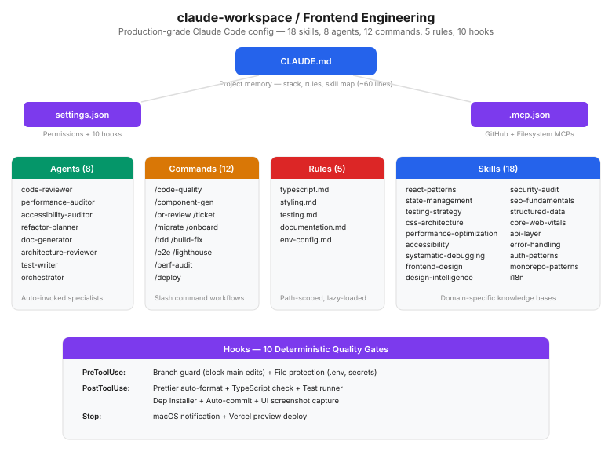

# Claude Workspace — Frontend Engineering Configuration

Production-grade Claude Code workspace for frontend teams. Drop into any React/TypeScript project — get expert-level AI pair programming with enforced standards, automated quality gates, and domain-specific knowledge.

## Architecture

<p align="center">
  
</p>

## Why Claude Workspace?

Most developers copy-paste prompts. This repo gives you a **version-controlled, team-shareable Claude Code configuration** with:
- 🎯 18 domain-specific skills (React, TypeScript, a11y, SEO, Core Web Vitals, API, Auth, i18n)
- 🤖 8 autonomous agents with auto-invocation rules
- ⚡ 12 slash commands for full ticket-to-PR workflows
- 🔒 10 hooks for deterministic quality gates
- 📐 5 path-scoped rules for contextual enforcement
- 📦 One-command install into any project

> Works with [Claude Code](https://claude.ai/code) — Anthropic's agentic CLI.

## Quick Install

```bash
# One-command install into your project
curl -fsSL https://raw.githubusercontent.com/Piyush8296/claude-workspace/main/install.sh | bash -s -- /path/to/your/project

# Or manual copy
git clone https://github.com/Piyush8296/claude-workspace.git /tmp/cw
cp -r /tmp/cw/.claude /tmp/cw/CLAUDE.md /tmp/cw/.mcp.json your-project/
```

Then edit `CLAUDE.md` to match your stack and run `claude`.

## What's Inside

```
claude-workspace/
├── CLAUDE.md                                  # Project memory (~60 lines, lean)
├── install.sh                                 # One-command installer
├── .claude/
│   ├── settings.json                          # Permissions, 10 hooks, env
│   ├── agents/ (8)
│   │   ├── code-reviewer.md                   # Auto-invoked after code changes
│   │   ├── performance-auditor.md             # Core Web Vitals & bundles
│   │   ├── accessibility-auditor.md           # WCAG 2.1 AA compliance
│   │   ├── refactor-planner.md                # Safe incremental migration
│   │   ├── doc-generator.md                   # Auto-writes JSDoc (background)
│   │   ├── architecture-reviewer.md           # Module boundaries (background)
│   │   ├── test-writer.md                     # Writes tests (background)
│   │   └── orchestrator.md                    # Unified health report (Opus)
│   ├── commands/ (12)
│   │   ├── code-quality.md                    # /code-quality <path>
│   │   ├── component-gen.md                   # /component-gen <Name>
│   │   ├── pr-review.md                       # /pr-review
│   │   ├── ticket.md                          # /ticket <PROJ-123>
│   │   ├── migrate.md                         # /migrate <from> <to>
│   │   ├── onboard.md                         # /onboard
│   │   ├── tdd.md                             # /tdd <feature>
│   │   ├── build-fix.md                       # /build-fix
│   │   ├── e2e.md                             # /e2e <user-flow>
│   │   ├── lighthouse.md                      # /lighthouse [url]
│   │   ├── perf-audit.md                      # /perf-audit [focus]
│   │   └── deploy.md                          # /deploy (pre-deploy checklist)
│   ├── rules/ (5)
│   │   ├── typescript.md                      # *.ts, *.tsx
│   │   ├── styling.md                         # *.css, tailwind.config.*
│   │   ├── testing.md                         # *.test.*, *.spec.*
│   │   ├── documentation.md                   # *.md, *.mdx
│   │   └── env-config.md                      # .env*, config files
│   ├── skills/ (18)
│   │   ├── react-patterns/SKILL.md            # Component architecture
│   │   ├── state-management/SKILL.md          # TanStack Query, Zustand, URL state
│   │   ├── testing-strategy/SKILL.md          # TDD, factories, mocking
│   │   ├── css-architecture/SKILL.md          # Tailwind, tokens, responsive
│   │   ├── performance-optimization/SKILL.md  # Bundles, splitting, virtualization
│   │   ├── accessibility/SKILL.md             # WCAG, ARIA, keyboard, focus
│   │   ├── systematic-debugging/SKILL.md      # 4-phase root cause analysis
│   │   ├── frontend-design/SKILL.md           # Aesthetics, typography, interactions
│   │   ├── design-intelligence/SKILL.md       # Claude Design + Google Stitch
│   │   ├── security-audit/SKILL.md            # XSS, CSP, secrets, auth, deps
│   │   ├── seo-fundamentals/SKILL.md          # Meta tags, OG, SSR, crawlability
│   │   ├── structured-data/SKILL.md           # JSON-LD schemas, GEO/AEO
│   │   ├── core-web-vitals/SKILL.md           # LCP, INP, CLS fix recipes
│   │   ├── api-layer/SKILL.md                 # Typed fetch, interceptors, retry
│   │   ├── error-handling/SKILL.md            # Error boundaries, normalization
│   │   ├── auth-patterns/SKILL.md             # NextAuth, middleware, RBAC
│   │   ├── monorepo-patterns/SKILL.md         # Turborepo, Nx, workspaces
│   │   └── i18n/SKILL.md                      # next-intl, react-intl, RTL, plurals
│   └── hooks/scripts/
│       └── screenshot.sh                      # UI screenshot capture
├── .mcp.json                                  # MCP server config
└── .gitignore
```

## Skills (18)

| Skill | What It Covers |
|-------|----------------|
| `react-patterns` | Component architecture, composition, state handling order |
| `state-management` | TanStack Query, Zustand, URL state, decision framework |
| `testing-strategy` | TDD, factory pattern, mocking, coverage targets |
| `css-architecture` | Tailwind patterns, design tokens, responsive, z-index |
| `performance-optimization` | Bundle splitting, lazy loading, virtualization |
| `accessibility` | WCAG 2.1 AA, ARIA, keyboard nav, focus management |
| `systematic-debugging` | 4-phase root cause analysis |
| `frontend-design` | Bold aesthetics, typography, micro-interactions |
| `design-intelligence` | Claude Design + Google Stitch workflows |
| `security-audit` | XSS, CSP, secrets, auth patterns, dependency vulns |
| `seo-fundamentals` | Meta tags, OG/Twitter cards, SSR vs CSR, crawlability |
| `structured-data` | JSON-LD schemas (Product, Article, FAQ, Breadcrumb), GEO/AEO |
| `core-web-vitals` | LCP, INP, CLS — diagnosis + specific React/Next.js fix recipes |
| `api-layer` | Typed fetch clients, interceptors, retry with backoff, AbortController |
| `error-handling` | Error boundaries hierarchy, custom error classes, normalization |
| `auth-patterns` | NextAuth/Auth.js, middleware protection, RBAC, token refresh |
| `monorepo-patterns` | Turborepo/Nx pipelines, shared packages, changesets |
| `i18n` | next-intl/react-intl, locale routing, RTL, ICU pluralization |

## Agents (8)

| Agent | Model | Trigger |
|-------|-------|---------|
| `code-reviewer` | Sonnet | Proactively after any code change |
| `performance-auditor` | Sonnet | Performance complaints or pre-launch |
| `accessibility-auditor` | Sonnet | UI work or a11y issues reported |
| `refactor-planner` | Sonnet | Before restructuring or migration |
| `doc-generator` | Haiku | After code changes (background) |
| `architecture-reviewer` | Sonnet | Adding modules or restructuring (background) |
| `test-writer` | Sonnet | After features or bug fixes (background) |
| `orchestrator` | Opus | Full project health check on demand |

## Commands (12)

| Command | What it does |
|---------|-------|
| `/code-quality <path>` | Lint + typecheck + manual review |
| `/component-gen <Name>` | Scaffold component + test + barrel |
| `/pr-review` | Review current branch changes |
| `/ticket <ID>` | Full ticket-to-PR workflow |
| `/migrate <from> <to>` | Guided migration with safety checks |
| `/onboard` | Explore and document the codebase |
| `/tdd <feature>` | Red-green-refactor TDD cycle |
| `/build-fix` | Auto-diagnose and fix build errors |
| `/e2e <flow>` | Generate Playwright E2E tests |
| `/lighthouse [url]` | Run Lighthouse audit, parse scores, generate fix list |
| `/perf-audit [focus]` | Bundle analysis, dep weight, images, fonts, third-party |
| `/deploy` | Pre-deployment readiness checklist |

## Rules (5)

| Rule | Glob Pattern | What It Enforces |
|------|-------------|------------------|
| `typescript` | `*.ts`, `*.tsx` | Strict types, no `any`, interface conventions |
| `styling` | `*.css`, `tailwind.config.*` | Design tokens, utility-first, responsive |
| `testing` | `*.test.*`, `*.spec.*` | AAA pattern, factories, coverage thresholds |
| `documentation` | `*.md`, `*.mdx` | Structure, frontmatter, linking |
| `env-config` | `.env*`, `config.ts` | Zod validation, typed config, no hardcoded secrets |

## Hooks (10)

| Hook | Event | What It Does |
|------|-------|--------------|
| Branch guard | PreToolUse | Blocks edits on `main` |
| File protection | PreToolUse | Blocks `.env`, production configs, secrets |
| Prettier | PostToolUse | Auto-formats JS/TS/JSX/TSX |
| TypeScript check | PostToolUse | `tsc --noEmit` on TS changes |
| Test runner | PostToolUse | Runs related tests |
| Dep installer | PostToolUse | Auto-install on `package.json` change |
| Auto-commit | PostToolUse | Stages + commits every edit |
| UI screenshot | PostToolUse | Captures app on UI file changes |
| Notification | Stop | macOS notification when done |
| Vercel preview | Stop | Deploy preview after clean build |

## Design Tools

- **[Claude Design](https://support.claude.com/en/articles/14604416-get-started-with-claude-design)** — Visual prototyping from conversation, exports to React
- **[Google Stitch](https://stitch.withgoogle.com/)** — Free multi-screen UI generation, exports to Tailwind/Vue/Flutter/SwiftUI

## Extending

- Add skills: `.claude/skills/<name>/SKILL.md`
- Add agents: `.claude/agents/<name>.md`
- Add rules: `.claude/rules/<name>.md` (with `globs:` frontmatter)
- Add commands: `.claude/commands/<name>.md`
- Update `CLAUDE.md` Quick Facts for your stack

## Philosophy

- **Lean CLAUDE.md** — under 65 lines; detail lives in skills and rules
- **Progressive disclosure** — Claude loads only what the task needs
- **Deterministic gates** — hooks enforce formatting and checks regardless of model
- **Composable** — skills cross-reference, agents delegate, commands orchestrate

---
<!-- Keywords: claude code configuration, anthropic claude workspace, claude system prompt, MCP tools, react typescript AI pair programming, claude agents, claude skills, frontend AI tooling, claude dotfiles, nextjs, tailwind -->

## License

MIT
